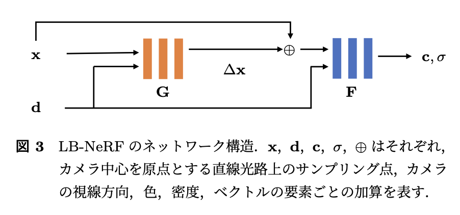

Share
====

Q&A about 2 works during the poster time.

### :one: OL2B-1: squeezeNeRF
- store a small cache of the nerual network of a __trained__ NeRF to speed up inference time (not training time).
- problem: cache size
   - NeRF: `O(n^5)`.    ----------------------- (x, y, z, $\theta$, $\phi$) 
   - fastNeRF: `O(n^3)`. about 2 GB. ------- (x, y, z) and ($\theta$, $\phi$)
   - squeezeNeRF: `O(n^2)`  about 40 MB --- (x, y), (x, z), (y, z) and ($\theta$, $\phi$)
   - `n` stands for the number of querrying points(a ray for each pixel, and hundreds of such points along each ray)
   - `power` is related to the inputs number of a neural network   -> ?(I haven't check how to cache a NN)

(Matsui-sensei)  
__Q__: "Factorization" is a technical term for liner algebra. It means that a big matrix is approximated by a product of smaller matrices. Your method is something like that? Or just using the two small MLPs?  
__A__: no we don’t factorize a matrix as done in linear algebra. In our paper, factorization refers to using smaller MLPs on a sub space of the entire input space.

- there is a work called TensoNeRF, which use factorization. It reduces the model size and the trainding time (not inference time in this work). Its figures of fatorization may similar to this work's idea in some sense. 
  - (how about the inference time of TensoNeRf, can it be improved using this idea with this real factorization?)

__Q__: why "factorize" (x, y, z) to (x, y), (x, z), (y, z)? it give me a sense of decoupling?  
__A__: (x, y), (x, z), (y, z) are 3 planes compare to that 3D volume. (which means there are 3 MLPs taking inputs of 2d coordinates, while one bigger MLP in fastNeRF taking (x, y, z) as input). We want to use the outputs of these 3 planes (3 small MLPs) to approximate the value at that 3D coordinate ( outputs of that bigger MLP). 

__Q__: How do you integerate the outputs of 3 smaller MLPs to approximate the outputs of one big MLP? I notice that in your paper, for $\sigma$, you time them up and for color you use addition operation. Is this enough for the good approximation? or is there any underlying math formula to do so.  
__A__: NO. we just find these simple idea works good enough. and we don't check any relations between the 3 results of (x,y), (x,z), (y,z) and the results of (x,y,z)

__Q__: How about your results of (x, y, z) to x, y, z? How bad is it.  
__A__: It doesn't converge, totally.

__Q__: is any chance that there are some more complex relations between the results of x, y, z and the results of (x,y,z)? so that you cannot just simply use multiplication for $\sigma$ and addition for color to approximate the results?  
__A__: that's good idea and we haven't consider that. but there is a work split nerf to three axes. (And he show me a work called CoordX). This work split to x, y, z and send the results to aother network ( to find the relations and get the final results? ) ( I haven't check it.) but for inference, this final network is also big to cache.

- [CoordX](https://openreview.net/forum?id=oAy7yPmdNz)

### 2️⃣ OL2B-2: Light bending, LB-NeRF

- objects in the transparency material with light refraction. so that the ray cannot be a straight line.
- offset network G + normal NeRF network F

__Q__: why oringial NeRF doesn't work? The results of original NeRF seems can still detect the transparency material, although images are blurry. can it be optimized?  
__A__: the ray is not straight in this case. ...  (I am thinking about something and I just remmember the first sentence. 😅)

- because in my opinion, I think no matter what objects are in the scene and what images can we observe at different view, as long as its 3D consistency, NeRF should be able to modle that scene. (I am still a little confused about why it don't work)

__Q__: How do you train your model. Do you train these two networks togeter?  
__A__: Yes, we just train them together using the training data.  

__Q__: Do they (G and F) have the same architecture? if so, I notice that the inputs type are the same, why can not one network works.  
__A__: NO, they are not the same. F is just the original NeRF network architecture and G, offset network is a normal MLP.  
__Q__: Oh, I see. In F, d and x are not inputed to the network at the same time. x first and d are inputed to some layers later. How about G?  
__A__: Yes, G doen't have the position encoding as F, and x and d are concatenated as inputs.  

__Q__: Can this modle detect the surface of the glass box (transparency material)? or the shape of it?  
__A__: Yes, where offset is 0. ...  

__Q__: Can we recover the normal object images from your model?  
__A__: Yes, just use F only as a trained NeRF, you can have the original object without transparency materials. (‼️ I asked him again to confirm this).  
__Q__: That's really impressive. You use images of objects in that glass box, which means there are light refractions. How does the model just seperate the knowledge of the objects and the glass material (or light refraction law?) into these two network, F and G, respectively.  

- I want to check this. If this works, it means that we can just remove the effect or add a surrounding transparency material to a object? Which is close to what Matsui-sensei talked, like object in a water or something. or if the "effect" in one case is learned separately by that G, can we extend this G to other trained normal NeRF to give them such effect? I don't know, just some thoughts, we can discuss it.
